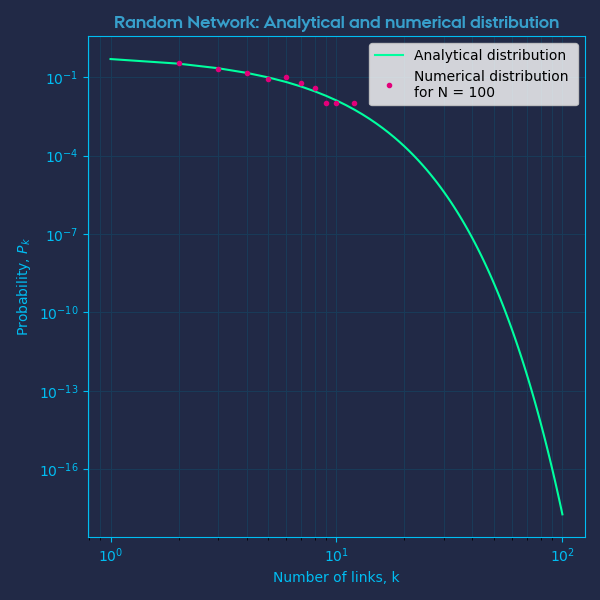

# Complex Networks
A repository for containing complex networks exercises


## Growth Exercise

Here different network growth types are investigated: 
  1. Network growth (New node with m open links) with random attachment.
  2. BA scale-free network.
      This works by drawing n random samples from the links vector and attach the new node to what the links is attached to.
      Thus nodes who already have many links will experience more growth.
  3. Modified Preferential growth
  4. Random modified growth: Network growth process with random link attachment

## Plot Explanation

Below are some plotted results for the different growth types. The explanation for these plots are:
- The number in each node indicates the order in which each particular node was created.
- The size of the node scales with the number of links attached to it.
- N, is the number of nodes in the network.
- The clustering coefficient, C, for each node is a "measure for local connectedness between neighbouring
nodes", and is calculated as:

```math
C_i = \frac{1}{k_i(k_i-1)} 
```
And for the whole network we can calculate an average clustering coefficient as:

```math
C = \frac{ \sum C_i}{N}
```
If all nodes are connected to each other directly with a link, this value is 1.


## 1. Random Network growth

<p float="center">
  
   
</p>


## 2. BA scale-free network growth / Preferential Growth

<p float="center">
  
   
</p>

## 3. Modified Preferential Growth

<p float="center">
  
   
</p>


## 4. Random Modified Growth

<p float="center">
  
   
</p>
